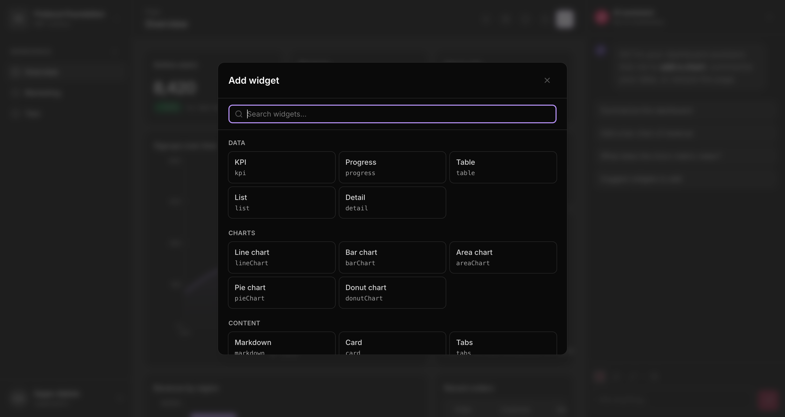
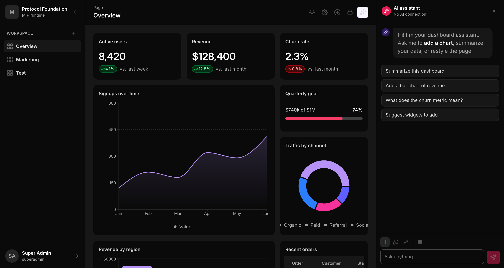
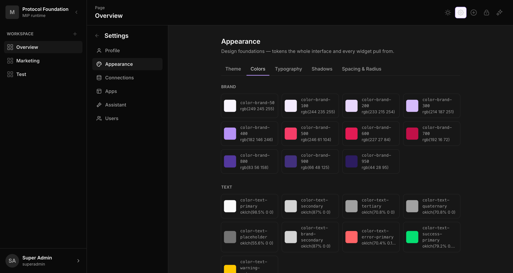
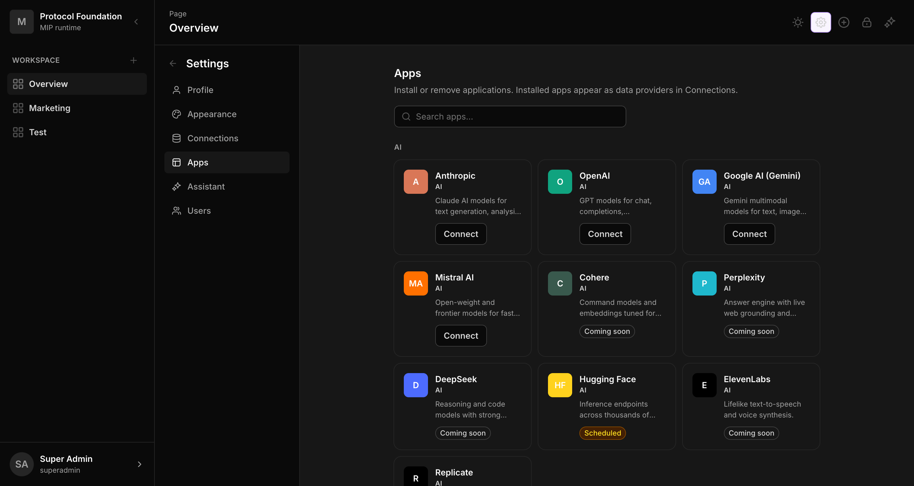
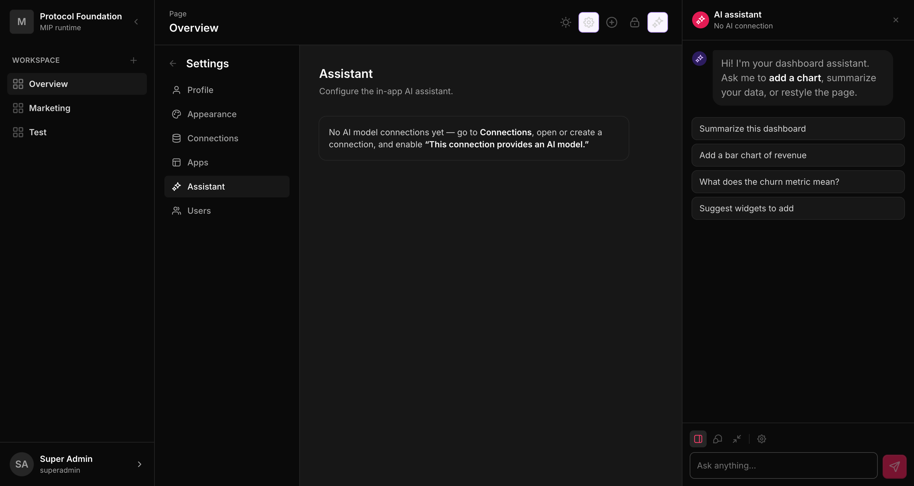

# Screen captures

Click any thumbnail to open it full-size. Captured live from the running
mip-tailwind app (`localhost:5183`). See `../migration-plan.md` (section I) for
each screen's UI/UX description.

## Captured (mip-tailwind)

| Screen | Preview |
|---|---|
| App shell / Dashboard |  |
| Widget gallery |  |
| Widget picker |  |
| AI chat — sidebar |  |
| Settings · Appearance (tokens) |  |
| Settings · Apps |  |
| Settings · Connections |  |
| Connection editor |  |
| Settings · Assistant |  |

Direct links: [app-shell](app-shell.png) · [gallery](gallery.png) · [widget-picker](widget-picker.png) · [chat-sidebar](chat-sidebar.png) · [settings-appearance](settings-appearance.png) · [settings-apps](settings-apps.png) · [settings-connections](settings-connections.png) · [connection-editor](connection-editor.png) · [settings-assistant](settings-assistant.png)

## Pending (drop a PNG with the name below, or ask me to capture live)

These are mostly **mip-only** screens (⬜ in the plan) or sub-states not yet
shot. Add `docs/screens/<file>` and it becomes a link here.

- `topbar.png` — Topbar
- `edit-mode.png` — Edit mode (drag/resize handles)
- `widget-editor.png` — Widget editor drawer
- `widget-expand.png` — Widget expand modal
- `chat-mode.png` — AI chat (floating)
- `chat-compact.png` — AI chat (compact bar)
- `assistant-settings-popover.png` — Assistant Settings (in-chat popover)
- `settings-profile.png` — Settings · Profile
- `settings-users.png` — Settings · Users
- `settings-access.png` — Settings · Access (mip)
- `layout-feed.png` — Layout / Feed responsive view (mip)
- `dashboard-settings-general.png` — Dashboard Settings · General (mip)
- `dashboard-settings-access.png` — Dashboard Settings · Access (mip)
- `dashboard-settings-dynamic-vars.png` — Dashboard Settings · Dynamic Variables (mip)
- `dashboard-templates.png` — Dashboard Templates (mip)
- `template-import.png` — Template import confirm (mip)
- `start.png` — Start screen
